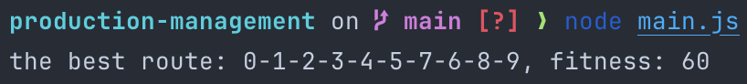

# Production Management

## HW1 Genetic Algorithm

### problem

One classic problem which is called **traveling salesman problem**. Imagine being a traveling salesman with several houses you have to visit every day. They’re all spread throughout the city, so you have to figure out the route that will let you visit them all in the shortest time.

### steps

1. For a given problem, we should **encode** a solution in the form of a stream of DNA where every gene is one of the parameters of the solution
2. Create a **population** of random solutions
3. Evaluate these random solutions, and assign points to them which is called **fitness**.
4. Sort them by points and discard the lower half.
5. Grab the top half of the remaining population, and mix it with the other half which will perform **crossover** and **mutate**
6. Back to step 3

### example code

predefined distances between cities:

| from/to |  0 |  1 |  2 |  3 |  4 |  5 |  6 |  7 |  8 |  9 |
|:-------:|:--:|:--:|:--:|:--:|:--:|:--:|:--:|:--:|:--:|:--:|
|    0    |  0 | 10 | 15 | 20 | 25 | 30 | 35 | 40 | 45 | 50 |
|    1    | 10 |  0 |  5 | 10 | 15 | 20 | 25 | 30 | 35 | 40 |
|    2    | 15 |  5 |  0 |  5 | 10 | 15 | 20 | 25 | 30 | 35 |
|    3    | 20 | 10 |  5 |  0 |  5 | 10 | 15 | 20 | 25 | 30 |
|    4    | 25 | 15 | 10 |  5 |  0 |  5 | 10 | 15 | 20 | 25 |
|    5    | 30 | 20 | 15 | 10 |  5 |  0 |  5 | 10 | 15 | 20 |
|    6    | 35 | 25 | 20 | 15 | 10 |  5 |  0 |  5 | 10 | 15 |
|    7    | 40 | 30 | 25 | 20 | 15 | 10 |  5 |  0 |  5 | 10 |
|    8    | 45 | 35 | 30 | 25 | 20 | 15 | 10 |  5 |  0 |  5 |
|    9    | 50 | 40 | 35 | 30 | 25 | 20 | 15 | 10 |  5 |  0 |

output:

`node main.js`

result in table:

| from/to |  0 |    1   |   2   |   3   |   4   |   5   |   6   |    7   |    8   |   9   |
|:-------:|:--:|:------:|:-----:|:-----:|:-----:|:-----:|:-----:|:------:|:------:|:-----:|
|    0    |  0 | **10** |   15  |   20  |   25  |   30  |   35  |   40   |   45   |   50  |
|    1    | 10 |    0   | **5** |   10  |   15  |   20  |   25  |   30   |   35   |   40  |
|    2    | 15 |    5   |   0   | **5** |   10  |   15  |   20  |   25   |   30   |   35  |
|    3    | 20 |   10   |   5   |   0   | **5** |   10  |   15  |   20   |   25   |   30  |
|    4    | 25 |   15   |   10  |   5   |   0   | **5** |   10  |   15   |   20   |   25  |
|    5    | 30 |   20   |   15  |   10  |   5   |   0   |   5   | **10** |   15   |   20  |
|    7    | 40 |   30   |   25  |   20  |   15  |   10  | **5** |    0   |    5   |   10  |
|    6    | 35 |   25   |   20  |   15  |   10  |   5   |   0   |    5   | **10** |   15  |
|    8    | 45 |   35   |   30  |   25  |   20  |   15  |   10  |    5   |    0   | **5** |

### Conclusion

The code is just a simple example of GA(Genetic Algorithm), and it don't consider many things such as initial points and backtracking, but GA is a interesting way to solving complex problems by letting the solution evolve on its own.

Although GA is not fit for all problems, it is still a useful way to solve problems like finding the best route, job assignment, string comparison, etc. I will find some interesting problems that could be solved by GA in reality and try to implement it in practice.
